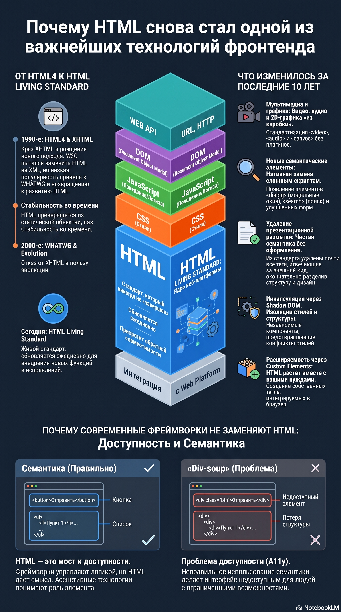

До недавнего времени HTML воспринимался как язык разметки документов, который после загрузки страницы преобразуется браузером в DOM.

В 2026 году такое объяснение уже недостаточно.

Современный HTML одновременно является источником данных для множества независимых подсистем веб-платформы: DOM, Accessibility Tree, Rendering Engine, Search Engine, искусственного интеллекта, браузерных API, серверного рендеринга и компонентных архитектур.

Поэтому сегодня HTML следует рассматривать не просто как язык разметки, а как универсальную модель данных современной Web Platform.

Именно эту точку зрения мы будем использовать на протяжении всей книги.

---

# Часть I. HTML как язык структуры

# Глава 1. Документ как модель данных

## Почему эта глава актуальна именно в 2026 году

На первый взгляд может показаться, что в первой главе не может быть ничего нового.

DOM существует с конца 1990-х годов, HTML изучают уже несколько десятилетий, а принципы семантической разметки появились ещё в эпоху HTML5. Кажется, что всё самое важное уже давно написано.

Однако именно в последние годы произошло фундаментальное изменение в роли HTML.

Изменился не сам язык.

Изменилась **Web Platform**.

Сегодня HTML перестал быть просто языком разметки документов. Он превратился в универсальный декларативный язык описания пользовательского интерфейса и главный источник данных для множества подсистем браузера.

Если раньше считалось, что HTML после загрузки страницы преобразуется в DOM, то в 2026 году это объяснение уже недостаточно.

Современный HTML одновременно используется:

- DOM для представления документа;
- CSS Engine для построения визуального оформления;
- Rendering Engine для создания Render Tree;
- Accessibility Engine для формирования Accessibility Tree;
- JavaScript Runtime для работы браузерных API;
- поисковыми системами;
- механизмами Server-Side Rendering;
- системами гидратации компонентов;
- браузерными расширениями;
- искусственным интеллектом и программными агентами.

Схематично современная архитектура выглядит следующим образом.

```text
                           HTML
                             │
     ┌───────────────────────┼────────────────────────┐
     │                       │                        │
     ▼                       ▼                        ▼
    DOM               Accessibility Tree        CSS Engine
     │                       │                        │
     │                       │                        ▼
     │                       │                  Render Tree
     │                       │                        │
     ▼                       ▼                        ▼
JavaScript API         Screen Readers            Rendering
     │
     ├────────► Search Engines
     ├────────► SSR / Hydration
     ├────────► Browser Extensions
     ├────────► AI Agents
     └────────► Web Platform APIs
```

Это означает, что HTML больше нельзя рассматривать исключительно как язык, предназначенный для отображения страниц.

В современной архитектуре веб-приложений HTML становится **универсальной моделью данных**, описывающей структуру, смысл и поведение интерфейса.

## Зачем нужна эта глава

После изучения данной главы вы сможете:

- понимать HTML как модель данных, а не как набор тегов;
- объяснить, почему DOM является фундаментом любой веб-страницы;
- различать понятия структуры, представления и поведения;
- понимать роль семантики в работе браузеров, поисковых систем и технологий доступности;
- осознанно выбирать HTML-элементы при проектировании интерфейсов.

---

# HTML как декларативная модель документа

Одной из наиболее распространённых ошибок начинающих разработчиков является восприятие HTML исключительно как языка визуальной разметки.

На самом деле HTML **не описывает внешний вид страницы**.

Он описывает:

- структуру документа;
- смысл его частей;
- отношения между элементами;
- точки взаимодействия пользователя с приложением.

Другими словами, HTML отвечает на вопрос:

> **Что представляет собой этот объект?**

а не

> **Как он должен выглядеть?**

За внешний вид отвечает CSS.

За поведение — JavaScript.

HTML же определяет структуру данных, с которой работают все остальные технологии веб-платформы.

---

# DOM как дерево документа

В современном понимании **DOM (Document Object Model)** представляет собой платформенно-независимую объектную модель документа.

После загрузки HTML браузер выполняет его разбор (**parsing**) и строит внутреннее представление страницы — **дерево DOM**.

```
Document
│
└── html
    ├── head
    │   ├── meta
    │   ├── title
    │   └── link
    │
    └── body
        ├── header
        ├── main
        │   ├── article
        │   └── section
        └── footer
```

Каждый элемент HTML становится объектом в памяти браузера.

Такие объекты называются **узлами (Node)**.

DOM содержит различные типы узлов:

| Тип                | Назначение                                      |
| ------------------ | ----------------------------------------------- |
| `Document`         | Корень документа                                |
| `DocumentType`     | Информация о типе документа (`<!DOCTYPE html>`) |
| `Element`          | HTML-элементы                                   |
| `Text`             | Текстовые узлы                                  |
| `Comment`          | Комментарии                                     |
| `DocumentFragment` | Временные фрагменты документа                   |

Именно с этими объектами работают JavaScript, CSS, браузерные API и современные фреймворки.

Важно понимать, что HTML-файл и DOM — это разные сущности.

```
HTML

↓

Parser

↓

DOM Tree

↓

CSSOM

↓

Render Tree

↓

Layout

↓

Paint
```

HTML является исходным кодом.

DOM — внутренней моделью документа.

---

# Документ как граф данных

DOM часто называют деревом.

С архитектурной точки зрения это действительно **ориентированное дерево объектов**, обладающее следующими свойствами:

- один корневой узел;
- каждый узел имеет единственного родителя;
- каждый узел может иметь множество потомков;
- структура полностью описывает документ.

Такой подход делает HTML похожим на работу с AST (Abstract Syntax Tree) в компиляторах.

Браузер фактически компилирует HTML в объектную модель, которая затем используется всеми подсистемами браузера.

---

# Семантика против оформления

Одним из важнейших принципов HTML является **семантическая разметка**.

Элемент HTML описывает не внешний вид объекта, а его смысл.

Например:

```html
<article></article>
```

означает:

> Это самостоятельная публикация.

а не

> Нарисуй прямоугольник.

Точно так же

```html
<nav></nav>
```

означает

> Навигация.

а не

> Горизонтальный блок.

CSS уже самостоятельно решает, как эта навигация должна выглядеть.

---

## Почему это важно

Когда HTML используется по назначению, выигрывают все участники процесса:

- браузер;
- поисковые системы;
- программы экранного доступа;
- инструменты машинного анализа;
- искусственный интеллект;
- разработчики.

Именно поэтому современный HTML называют **семантическим языком описания документов**.

---

# Документ против приложения

Исторически HTML создавался для публикации научных документов.

Однако развитие браузеров постепенно превратило веб в универсальную платформу приложений.

Несмотря на это, в спецификации HTML до сих пор используется термин **документ**.

Почему?

Потому что даже сложное веб-приложение остаётся документом.

Например:

- интернет-магазин;
- CRM;
- редактор изображений;
- IDE в браузере;
- почтовый клиент.

Все они содержат:

- заголовки;
- формы;
- кнопки;
- меню;
- таблицы;
- диалоги.

Другими словами, приложение представляет собой документ с большим количеством интерактивных компонентов.

Современный HTML постепенно расширяется именно в этом направлении.

Появляются новые элементы и API:

- `<dialog>` — Baseline *Widely available* с марта 2022 года, самая зрелая из перечисленных технологий;
- Popover API — Baseline *Newly available* с января 2025 года;
- Declarative Shadow DOM — Baseline *Newly available* с августа 2024 года;
- View Transitions API — same-document-переходы стали Baseline *Newly available* в октябре 2025 года, но cross-document-переходы (между страницами MPA) на момент написания книги поддерживаются в Chromium и Safari и всё ещё не реализованы в Firefox;
- Navigation API — достиг Baseline *Newly available* в январе 2026 года после того, как его поддержали Firefox 147 и Safari 26.2, хотя в Safari пока отсутствует часть возможностей (`precommitHandler`), нужных для сложных сценариев перехвата навигации.

Иными словами, эти технологии находятся на разных стадиях зрелости: одни (`<dialog>`) уже можно использовать без раздумий, другие требуют feature-detection или прогрессивного улучшения ещё какое-то время. Мы будем возвращаться к статусу конкретных API в соответствующих главах книги.

HTML становится декларативным способом описания интерфейса приложения.

---

# HTML и доступность

Одним из важнейших преимуществ HTML является встроенная поддержка **Accessibility (A11y)**.

Браузер автоматически строит ещё одну модель документа — **Accessibility Tree**.

```
HTML

↓

DOM

↓

Accessibility Tree

↓

Screen Reader
```

Программы экранного доступа работают именно с этой структурой.

Если разработчик использует:

```html
<button></button>
```

то браузер уже знает:

- что это кнопка;
- что её можно активировать клавишей Space;
- что её можно активировать клавишей Enter;
- как объявить её пользователю.

Если вместо этого используется

```html
<div onclick="..."></div>
```

браузер ничего этого не знает.

Разработчику приходится реализовывать всё самостоятельно.

Поэтому существует одно из важнейших правил современной веб-разработки.

> **Используйте нативный HTML прежде, чем писать JavaScript.**

---

# HTML и SEO

Для поисковых систем HTML является основным источником информации о странице.

Поисковые роботы анализируют:

- структуру документа;
- заголовки;
- ссылки;
- статьи;
- изображения;
- навигацию;
- метаданные.

Чем более семантична разметка, тем легче поисковой системе понять содержание страницы.

Современный HTML также предоставляет дополнительные механизмы:

- Microdata;
- RDFa;
- JSON-LD;
- Open Graph;
- Schema.org.

Именно они позволяют превращать обычную страницу в структурированный источник данных.

Сегодня HTML читают не только поисковые системы.

Его анализируют:

- голосовые помощники;
- генеративные ИИ;
- браузеры;
- программы доступности;
- поисковые роботы;
- различные автоматизированные агенты.

Поэтому семантика становится всё более важной.

---

# HTML как контракт Web Platform

Одной из главных идей современной веб-разработки является понимание HTML как **контракта** между разработчиком и браузером.

Разработчик описывает:

- структуру;
- смысл;
- интерактивные элементы.

Браузер гарантирует:

- построение DOM;
- создание Accessibility Tree;
- работу встроенных элементов;
- интеграцию с CSS;
- интеграцию с JavaScript;
- взаимодействие с браузерными API.

Именно поэтому современные фреймворки практически не создают собственный язык разметки.

## Они используют HTML как универсальный язык взаимодействия с Web Platform.

# Что нового произошло после 2025 года?

Парадоксально, но **сам HTML почти не изменился**.

Изменилось другое:

> **Изменилось количество систем, которые используют HTML как источник данных.**

Именно это является главным изменением Web Platform последних лет.

---

## 1. HTML перестал быть входом только для браузера

В старых книгах процесс выглядел так:

```text
HTML

↓

DOM

↓

CSS + JavaScript

↓

Страница
```

Это больше не соответствует современной архитектуре браузеров.

В 2026 году HTML становится исходными данными сразу для множества независимых подсистем.

```text
                    HTML
                      │
      ┌───────────────┼────────────────┐
      │               │                │
      ▼               ▼                ▼
     DOM       Accessibility Tree   CSS Parser
      │                                │
      ▼                                ▼
 JavaScript                      Render Tree
      │
      ├────────► View Transition API
      │
      ├────────► Navigation API
      │
      ├────────► Declarative Shadow DOM
      │
      ├────────► AI Agents
      │
      ├────────► Search Engines
      │
      └────────► Browser Extensions
```

> HTML — это уже не модель документа для браузера. Это универсальная модель данных всей Web Platform.

---

# 2. DOM перестал быть главной моделью

В книгах по HTML всегда писали:

> HTML превращается в DOM.

Сегодня это слишком упрощённо.

Правильнее сказать:

> HTML является исходным описанием, на основе которого браузер строит сразу несколько специализированных моделей.

Например:

```text
HTML

↓

DOM

↓

Accessibility Tree

↓

Render Tree

↓

Layout Tree

↓

Paint Commands
```

DOM — лишь первая из них.

---

# 3. HTML стал частью архитектуры браузера

Раньше HTML рассматривался как язык.

Сегодня правильнее говорить:

> HTML — один из архитектурных слоёв браузера.

Например,

```text
Application

↓

Framework

↓

HTML

↓

Browser Engine

↓

Operating System
```

Получается интересная мысль.

Angular взаимодействует не напрямую с браузером.

Он взаимодействует через HTML.

---

# 4. HTML становится универсальным обменным форматом

Если посмотреть на современные технологии

- SSR;
- Static Site Generation;
- Streaming SSR;
- Partial Hydration;
- Islands Architecture;
- React Server Components;
- Angular SSR;
- Astro;
- Qwik,

то оказывается,

что между сервером и браузером почти всегда передаётся именно HTML.

Получается

```text
Server

↓

HTML

↓

Browser

↓

DOM
```

HTML снова становится главным транспортным форматом Web Platform.

Это очень интересная мысль, которой почти нет в книгах.

---

# 5. Документ становится предметной моделью

В классических книгах говорили

> HTML описывает документ.

В 2026 году лучше говорить иначе.

> HTML описывает предметную модель пользовательского интерфейса.

Например,

```html
<article>
  <header>
    <h1>...</h1>
  </header>
</article>
```

Это уже не "разметка".

Это описание бизнес-объекта

```
Article

↓

Header

↓

Title

↓

Body
```

Очень похоже на объектную модель.

---

# 6. HTML становится источником данных для AI

Вот этого вообще нет почти нигде.

Современные AI-системы анализируют не только CSS-классы и визуальную компоновку — семантическая структура HTML часто оказывается для них более надёжным сигналом о содержании страницы, чем оформление.

Для LLM гораздо проще понять

```html
<article>
  <h1>...</h1>

  <section>...</section>
</article>
```

чем

```html
<div class="wrapper">
  <div class="content">
    <div class="big-title">...</div>
  </div>
</div>
```

То есть HTML становится интерфейсом общения не только с браузером, но и с искусственным интеллектом.

---

# 7. DOM становится менее важным, чем декларативная модель

Раньше разработчики думали

```
DOM

↓

JavaScript

↓

Изменяем страницу
```

Сегодня всё чаще происходит наоборот.

```text
HTML

↓

Browser API

↓

Готовое поведение
```

Например

```html
<dialog></dialog>
```

или

```html
<details></details>
```

или

```html
<input type="date" />
```

Во многих случаях JavaScript вообще не нужен.

Это очень сильный тренд последних лет.

---

# 8. HTML становится языком архитектуры

Раньше обсуждали

> Какой тег использовать?

В книге **Modern HTML 2026** правильнее задавать другой вопрос.

> Какую модель предметной области описывает документ?

Например,

вместо

```
div

↓

div

↓

div

↓

div
```

мы получаем

```
main

↓

article

↓

section

↓

figure
```

Это уже архитектурная диаграмма предметной области.

---

## Статус упомянутых API на момент написания книги

Раздел выше сознательно оперирует именами API (`View Transition API`, `Navigation API`, Declarative Shadow DOM) как уже состоявшимися технологиями Web Platform. Чтобы не создавать у читателя иллюзию, что все они одинаково зрелы и одинаково безопасны для продакшна без проверки поддержки, вот сводка на момент выхода книги:

| Технология | Baseline-статус | С какого момента |
|---|---|---|
| `<dialog>` | Widely available | март 2022 |
| Declarative Shadow DOM (`shadowrootmode`) | Newly available | август 2024 |
| Popover API | Newly available | январь 2025 |
| View Transitions API (same-document) | Newly available | октябрь 2025 |
| View Transitions API (cross-document) | Не входит в Baseline | нет поддержки в Firefox |
| Navigation API | Newly available | январь 2026 |

«Newly available» означает, что фича одновременно поддерживается последними стабильными версиями всех четырёх основных браузерных движков — но не гарантирует автоматической поддержки в старых версиях браузеров пользователей и не то же самое, что «Widely available» (устоявшаяся поддержка в течение примерно 30 месяцев). При проектировании интерфейса на основе таких API стоит закладывать прогрессивное улучшение или feature-detection.

---

# Основные выводы

После изучения главы необходимо запомнить несколько ключевых идей.

- HTML — это язык структуры и смысла, а не оформления.
- HTML-файл является исходным кодом документа, а браузер преобразует его в DOM.
- DOM представляет собой объектную модель документа, с которой работают CSS, JavaScript и браузерные API.
- Семантическая разметка улучшает доступность, поисковую оптимизацию и сопровождаемость проекта.
- Даже современное веб-приложение остаётся документом с точки зрения веб-платформы.
- HTML служит фундаментом для всех современных фронтенд-фреймворков и браузерных API.
- Не все API, расширяющие возможности HTML, одинаково зрелы: перед использованием в продакшне стоит сверяться с их текущим Baseline-статусом.


---

# Что дальше

В следующей главе мы подробно рассмотрим **семантические элементы HTML** и разберём, почему выбор между `<section>`, `<article>`, `<main>`, `<aside>` и обычным `<div>` влияет не только на читаемость кода, но и на доступность, SEO и архитектуру приложения.
