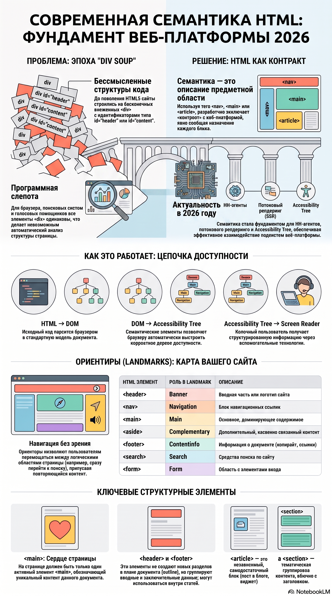

# Часть I. HTML как язык структуры

# Глава 2. Современная семантика

> **Главная идея главы**
>
> Современный HTML — это не набор "красивых тегов", а язык описания смысла документа.
> Семантические элементы позволяют браузеру, поисковым системам, технологиям доступности и другим программным агентам понимать структуру страницы без анализа её внешнего вида.
> Также вы узнаете почему их значение выросло в эпоху SSR, AI, компонентных архитектур и постоянно расширяющейся Web Platform.

---

# Почему эта глава актуальна именно в 2026 году

Семантические элементы HTML появились более пятнадцати лет назад. Поэтому может показаться, что тема современной семантики давно исчерпана.

На самом деле произошло обратное.

Если в эпоху HTML5 семантика воспринималась главным образом как средство повышения доступности и поисковой оптимизации, то в 2026 году она стала фундаментом всей Web Platform.

Современный HTML одновременно служит источником данных для браузерного движка, CSS, JavaScript, Accessibility Tree, поисковых систем, генеративного искусственного интеллекта, Server-Side Rendering, потокового рендеринга и компонентных архитектур.

Именно поэтому сегодня вопрос выбора между `<article>` и `<div>` — это уже не вопрос стиля программирования. Это архитектурное решение, влияющее на взаимодействие страницы с множеством подсистем веб-платформы.

В этой главе мы будем рассматривать семантические элементы не как «новые теги HTML5», а как язык описания предметной модели современного веб-приложения.

# Зачем появилась семантика

До появления HTML5 большинство сайтов выглядело примерно одинаково.

```html
<div id="header">
  <div id="menu">
    <div id="content">
      <div id="sidebar">
        <div id="footer"></div>
      </div>
    </div>
  </div>
</div>
```

Такой подход получил название **div soup**.

Для браузера все эти элементы были абсолютно одинаковыми.

Невозможно было определить:

- где начинается основное содержимое;
- где располагается навигация;
- где находится статья;
- где заканчивается документ.

Похожую проблему испытывали:

- поисковые системы;
- программы экранного доступа;
- браузерные расширения;
- голосовые помощники;
- системы машинного анализа.

HTML5 решил эту проблему, введя **семантические элементы**.

Теперь разработчик может явно сообщить браузеру назначение каждого блока страницы.

---

# Семантика как контракт

Когда разработчик пишет

```html
<nav></nav>
```

он сообщает браузеру:

> Этот раздел содержит навигацию.

Когда используется

```html
<main></main>
```

браузер понимает:

> Здесь находится основной контент страницы.

При использовании

```html
<article></article>
```

становится понятно:

> Это самостоятельная публикация.

HTML перестал быть просто языком отображения.

Он стал языком описания предметной области.

---

# Семантика и Accessibility Tree

Современный браузер строит несколько моделей документа одновременно.

```
HTML

↓

DOM

↓

Accessibility Tree

↓

Screen Reader
```

Именно семантические элементы позволяют браузеру автоматически создать корректное дерево доступности.

Например,

```html
<nav></nav>
```

становится Landmark Navigation.

```
Navigation

↓

Главное меню сайта
```

А

```html
<main></main>
```

превращается в

```
Main Landmark
```

Благодаря этому пользователь программы экранного доступа может мгновенно перейти к основному содержимому страницы, пропустив меню и боковые панели.

---

# Landmarks

Одной из важнейших возможностей современной семантики являются **ориентиры (Landmarks)**.

Они позволяют пользователю перемещаться по странице не по порядку элементов, а между логическими областями документа.

К таким элементам относятся:

| Элемент    | Landmark                    |
| ---------- | --------------------------- |
| `<header>` | Banner (при верхнем уровне) |
| `<nav>`    | Navigation                  |
| `<main>`   | Main                        |
| `<aside>`  | Complementary               |
| `<footer>` | Contentinfo (для документа) |
| `<form>`   | Form                        |
| `<search>` | Search                      |

Именно Landmarks являются одной из причин появления большинства современных семантических элементов.

---

# Структурные элементы документа

## `<header>`

- `<header>`: Представляет собой группу вводных или навигационных средств. Обычно он содержит заголовки (`<h1>`–`<h6>`), логотипы, навигационные меню или формы поиска.
- _Важно помнить:_ `<header>` не является контентом разделения (`sectioning content`) и не создает новый раздел в логическом плане документа (`outline`). Он может использоваться многократно (например, в шапке сайта, шапке статьи и т.д.).

```
<header>

↓

Banner

↓

Accessibility Tree
```

---

## `<main>`

Очень важно понимать, что

```
<main>
```

не означает

> Центральная колонка сайта.

Он означает

> Основное содержимое данного документа.

На странице должен присутствовать только один активный `<main>`.

---

## `<footer>`

- `<footer>`: Содержит информацию о ближайшем предке — разделе или всем документе (авторство, ссылки на связанные документы, юридические уведомления, авторские права).
- _Особенности:_ Как и `<header>`, он не создает нового подраздела. Подвал не обязательно должен находиться в самом конце раздела или страницы, хотя чаще всего располагается именно там.

```
<footer>

↓

Content Information
```

---

# Семантические разделы

## `<article>`

Главное правило.

Если элемент можно опубликовать отдельно —

скорее всего,

это `<article>`.

Например:

- статья;
- комментарий;
- карточка товара;
- сообщение форума;
- пост социальной сети.

---

## `<section>`

Очень распространённая ошибка — использовать `<section>` как замену `<div>`. Это неверно. `<section>` — не контейнер, а тематический раздел документа.
Практическое правило: если раздел имеет собственный заголовок, скорее всего, нужно использовать `<section>`.

---

## `<aside>`

Современный `<aside>` чаще всего используется для:

- боковых панелей;
- дополнительных материалов;
- рекламы;
- списка похожих статей;
- справочной информации.

При этом его содержимое не должно быть обязательным для понимания основного текста.

---

# Специализированные элементы

...

Добавить

## `<figure>`

Важно понимать, что

```
<figure>
```

может содержать не только изображение.

Например

```html
<figure>
  <pre>

код программы

</pre
  >

  <figcaption>Листинг 2.1</figcaption>
</figure>
```

или

```html
<figure>
  <blockquote>...</blockquote>

  <figcaption>Цитата Тима Бернерса-Ли</figcaption>
</figure>
```

---

## `<time>`

Следует всегда использовать атрибут

```
datetime
```

именно в формате ISO-8601.

Это облегчает:

- индексацию;
- машинную обработку;
- экспорт календарей;
- анализ данных.

---

# Когда использовать `<div>`

Самый важный вопрос современной семантики.

Правило можно сформулировать очень просто.

```
Существует семантический элемент?

↓

Да

↓

Используем его.

↓

Нет

↓

Используем <div>.
```

Именно поэтому

```
<div>
```

называют

> generic container

или

> элементом последнего выбора.

---

# Семантика и современные фреймворки

Иногда можно услышать мнение:

> Angular всё равно генерирует HTML.

Это правда.

Но Angular не может самостоятельно определить, что означает ваш компонент.

Например,

```html
<app-news-list></app-news-list>
```

для браузера —

не статья.

Если внутри компонента находится

```html
<article></article>
```

браузер понимает его назначение.

Поэтому современные фреймворки не отменяют необходимость правильной семантики.

Они лишь помогают генерировать HTML.

---

# Архитектурные рекомендации

При проектировании страницы полезно придерживаться следующего порядка вопросов.

```
Что представляет собой данный объект?

↓

Есть ли для него семантический элемент?

↓

Да

↓

Используем его.

↓

Нет

↓

Используем div.
```

---

# Как изменилась роль семантики в современной Web Platform?

И вот здесь появилось действительно много нового.

---

## 1. Семантика перестала быть только про Accessibility

В книгах 2015–2024 годов обычно писали:

> Используйте `<article>`, потому что это полезно для SEO.

или

> Используйте `<nav>`, потому что Screen Reader поймёт структуру страницы.

В 2026 году это лишь малая часть картины.

Сегодня HTML является **единым источником истины (Single Source of Truth)** сразу для множества подсистем браузера.

```
HTML

      │

      ├────────► DOM

      ├────────► Accessibility Tree

      ├────────► Search Engine

      ├────────► AI Agents

      ├────────► Browser APIs

      ├────────► View Transitions

      ├────────► Web Components

      └────────► Rendering Engine
```

То есть семантика стала контрактом сразу для многих потребителей.

---

## 2. HTML стал языком декларативного программирования

Это, наверное, главное изменение последних лет.

Раньше HTML отвечал почти исключительно за структуру документа.

Сегодня HTML всё чаще становится декларативным API браузера.

Например

```
<dialog>
```

уже не просто обозначает

> диалог.

Он говорит браузеру

> Создай полноценное модальное окно.

Без JavaScript.

---

То же относится к

```
popover
```

```
commandfor
```

```
inert
```

```
details
```

```
template
```

```
slot
```

```
shadowrootmode
```

HTML постепенно начинает описывать не только структуру документа, но и **поведение интерфейса**.

Это принципиально новая тенденция Web Platform.

---

## 3. Семантика становится API для искусственного интеллекта

Раньше HTML анализировали:

- браузеры;
- поисковые системы;
- Screen Reader.

Теперь появились новые потребители.

Например

- AI Search;
- LLM;
- AI Agents;
- браузерные ассистенты;
- автономные веб-агенты.

Для них семантическая структура намного важнее CSS.

Представьте два документа.

Первый

```html
<div class="big-title">Новости</div>
```

Второй

```html
<article>
  <h1>Новости</h1>
</article>
```

Для человека оба выглядят одинаково.

Для ИИ —

нет.

Во втором случае модель сразу понимает

- это статья;
- есть главный заголовок;
- дальше идёт содержание.

---

## 4. Семантика становится частью SSR

До появления SSR многие страницы полностью генерировались JavaScript.

Сегодня ситуация изменилась.

Практически все современные фреймворки делают ставку на

- SSR;
- Streaming SSR;
- Partial Hydration;
- Islands Architecture.

Это означает, что HTML снова становится первым объектом, который получает браузер.

Следовательно, качество HTML снова становится критически важным.

---

## 5. Семантика становится частью производительности

Кажется, что

```
<article>
```

никак не связан с производительностью.

Но связан.

Чем лучше структурирован HTML, тем проще:

- выполнять потоковый рендеринг;
- разделять страницу на компоненты;
- выполнять частичную гидратацию;
- строить Islands;
- выполнять Server Components.

То есть современная архитектура производительности начинается именно с HTML.

---

## 6. Семантика стала фундаментом Design Systems

Раньше Design System состояла примерно из

```
Button

Card

Input

Modal
```

Сегодня хороший Design System начинает задавать вопрос

> Какой HTML должен генерировать компонент?

Например

```
Card
```

должен ли рендериться как

```
<div>
```

или

```
<article>
```

Если компонент представляет самостоятельный объект,

то

```
<article>
```

почти всегда правильнее.

Получается, Design System проектирует не CSS.

Он проектирует HTML.

---

## 7. Семантика становится частью архитектуры компонентов

В Angular

```
<app-product-card>
```

ничего не говорит браузеру.

Но если внутри компонента находится

```html
<article>...</article>
```

тогда браузер понимает, что это самостоятельная публикация.

Получается интересная мысль.

Современный компонент имеет **две архитектуры**.

Внешнюю

```
Angular Component
```

и внутреннюю

```
Semantic HTML
```

Именно внутренняя архитектура взаимодействует с Web Platform.

---

## 8. HTML становится интерфейсом между человеком и браузером

Раньше говорили

> HTML описывает страницу.

Сегодня точнее сказать иначе.

> HTML описывает предметную модель интерфейса.

CSS отвечает за внешний вид.

JavaScript — за изменение состояния.

HTML — за смысл объектов.

---

# Основные выводы

После изучения главы необходимо помнить.

- Семантика описывает смысл, а не оформление.
- Современный HTML предоставляет десятки специализированных элементов.
- Семантические элементы автоматически используются Accessibility Tree.
- Правильная семантика улучшает SEO.
- Современные фреймворки работают поверх семантического HTML.
- `<div>` остаётся важным элементом, но только тогда, когда отсутствует более подходящий семантический тег.



## Как браузер "видит" страницу

```
HTML
   │
   ▼
DOM
   │
   ├────────► CSSOM
   │             │
   │             ▼
   │        Render Tree
   │
   ├────────► Accessibility Tree
   │
   ├────────► SEO Parser
   │
   ├────────► View Transition API
   │
   └────────► JavaScript
```

---

# Что дальше

В следующей главе мы увидим, что современный HTML — это не только язык структуры, но и **декларативный интерфейс браузера**.

Мы познакомимся с концепцией **HTML как API Web Platform** и увидим, почему новые возможности HTML продолжают появляться даже спустя более тридцати лет после создания языка.
