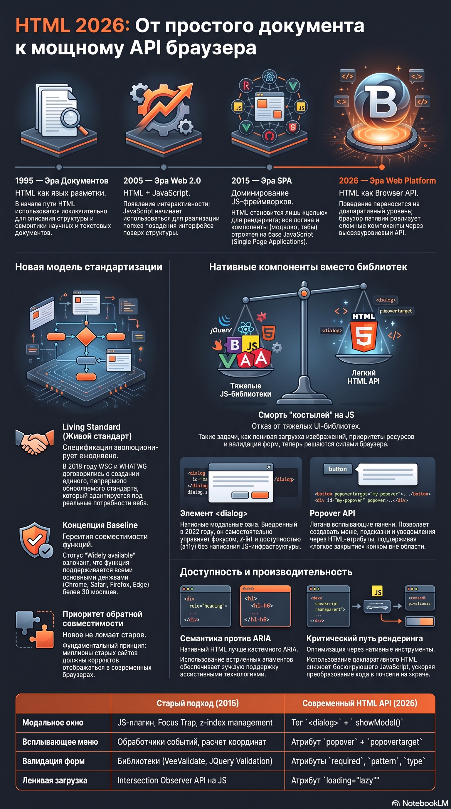

# Глава 3. HTML как API браузера

> **Самое важное изменение последних лет заключается не в появлении новых HTML-элементов, а в изменении роли HTML. Если раньше HTML был языком описания документа, а JavaScript — языком поведения, то современная Web Platform всё чаще переносит поведение на декларативный уровень. HTML становится высокоуровневым API платформы, а браузер — интеллектуальной средой выполнения, которая самостоятельно реализует всё больше функций, ранее требовавших пользовательского JavaScript.**

Именно эта смена парадигмы, а не список новых тегов и атрибутов, делает HTML 2026 качественно отличным от HTML образца 2015 или даже 2022 года.

## Почему эта глава актуальна именно в 2026 году

Если открыть книгу по HTML десятилетней давности, можно заметить интересную закономерность.

HTML описывается как язык структуры документа.

CSS отвечает за оформление.

JavaScript реализует всё поведение интерфейса.

Такое разделение долгое время считалось фундаментальным принципом веб-разработки.

Однако за последние несколько лет Web Platform начала развиваться в другом направлении.

Современные браузеры всё чаще предоставляют готовые возможности непосредственно на уровне HTML.

Диалоговые окна, всплывающие панели, встроенная валидация форм, ленивые изображения, приоритеты загрузки ресурсов, Declarative Shadow DOM, Popover API и многие другие механизмы больше не требуют написания собственной инфраструктуры на JavaScript.

В результате HTML постепенно превращается из языка описания структуры в высокоуровневый декларативный API браузера.

Это одно из самых важных изменений современной Web Platform.

В этой главе мы будем рассматривать HTML именно с этой точки зрения.

---

## 3.1. Эволюция HTML Living Standard

## Эволюция Web Platform

```
1995

HTML

↓

Документы
```

↓

```
2005

HTML

↓

Документы

+

JavaScript

↓

Web 2.0
```

↓

```
2015

HTML

↓

JavaScript Framework

↓

Single Page Application
```

↓

```
2026

HTML

↓

Browser API

↓

Native Components

↓

Web Platform
```

Исторически HTML развивался дискретными версиями (HTML4, XHTML, HTML5), каждая из которых требовала многолетних циклов согласования консорциумами, выпуска стандартов и долгого ожидания поддержки в браузерах. Современный ландшафт веб-стандартов кардинально иным образом организован вокруг концепции **Living Standard** (Живой стандарт).

### Разрыв и воссоединение WHATWG и W3C

В 2011 году в сообществе разработчиков произошел стратегический раскол. Консорциум **W3C** пытался зафиксировать спецификацию в виде монолитных версий (таких как планировавшийся HTML5.x и XHTML2), в то время как группа **WHATWG** (Web Hypertext Application Technology Working Group), состоящая из инженеров ведущих браузерных вендоров (Apple, Google, Mozilla, Microsoft), настаивала на непрерывном обновлении спецификации по мере появления реальных потребностей веба и исправления багов.

В 2019 году организации пришли к историческому соглашению: W3C официально признал Living Standard от WHATWG единственной актуальной спецификацией HTML и DOM. Этот подход базируется на трех фундаментальных принципах:

1. **Обратная совместимость (Backward Compatibility):** Нововведения ни при каких условиях не должны «ломать» существующие миллионы веб-страниц в интернете. Старые сайты обязаны корректно рендериться в новых браузерах.
2. **Соответствие реализации (Implementation-Driven Standards):** Спецификация описывает то, как браузеры фактически работают в реальном мире, а не теоретические абстракции. Если стандарт расходится с поведением популярных браузеров, стандарт адаптируется под реальность.
3. **Непрерывность обновлений:** Спецификация эволюционирует ежедневно. Как только фича проходит все стадии тестирования и внедряется в движки (Blink, Gecko, WebKit), она становится частью стандарта без ожидания мажорных релизов платформы.

---

## 3.2. Нативные компоненты вместо библиотек: Эра Baseline

Благодаря модели непрерывного обновления, современная браузерная платформа регулярно пополняется мощными нативными инструментами. То, для чего десятилетиями подключались тяжелые сторонние библиотеки на JavaScript (модальные окна, тултипы, аккордеоны, валидация форм), теперь решается декларативно силами самого браузера.

### Статус Baseline

Концепция **Baseline**, поддерживаемая W3C и Baseline Working Group, классифицирует веб-платформенные функции на две категории:

- **Baseline Newly available:** Функция поддерживается всеми основными браузерами (Chrome, Safari, Firefox, Edge).
- **Baseline Widely available:** Функция доступна повсеместно на протяжении как минимум 30 месяцев.

### Ключевые нативные API в HTML (HTML Native API)

#### 1. Элемент `<dialog>`

Внедренный в широкую практику в 2022 году, элемент `<dialog>` кардинально изменил подход к созданию модальных окон и диалогов. Раньше разработчикам приходилось вручную управлять фокусом, пересчитывать z-index, вешать слушатели кликов вне окна и реализовывать изоляцию фокуса (focus trap) для доступности (a11y).

```
<dialog>
```

не является просто элементом.

Он является

> Native Dialog API

`<dialog>` берет на себя всю эту сложнейшую логику на уровне платформы:

- **Интеграция со скринридерами:** Автоматически сообщает вспомогательным технологиям о появлении модального слоя.
- **Блокировка остальной страницы (Inertness):** При открытии через метод `.showModal()` фоновый контент становится неактивным для кликов и клавиатурного ввода.
- **Управление фокусом:** Автоматически переносит фокус на первый интерактивный элемент внутри диалога и возвращает его на вызывавшую кнопку при закрытии.

```html
<button id="open-btn">Открыть настройки</button>

<dialog id="settings-dialog">
  <form method="dialog">
    <h2>Системные настройки</h2>
    <p>Управление параметрами производительности движка.</p>
    <menu>
      <button value="cancel">Отмена</button>
      <button value="save">Сохранить</button>
    </menu>
  </form>
</dialog>

<script>
  const dialog = document.getElementById('settings-dialog');
  document.getElementById('open-btn').addEventListener('click', () => {
    dialog.showModal(); // Императивный вызов нативного API браузера
  });
</script>
```

#### 2. Popover API

Появившийся в спецификации и достигший статуса Baseline стандарт **Popover API** позволяет создавать всплывающие элементы интерфейса (контекстные меню, панели фильтров, подсказки, всплывающие профили) с помощью минимального набора атрибутов.

```
popover
```

—

> Native Overlay API

Главное достижение Popover API — концепция **Light Dismiss** (легкое закрытие) и управление слоями (Top Layer). Браузер самостоятельно выносит всплывающий элемент в отдельный верхний слой поверх остального контента, избавляя разработчика от проблем с `z-index`, а также автоматически закрывает попover при клике вне его области или нажатии клавиши `Escape`.

```html
<!-- Кнопка управления попловером -->
<button popovertarget="my-popover">Открыть панель</button>

<!-- Сам попover элемент -->
<div id="popover" popover>
  <h3>Быстрое меню</h3>
  <p>Этот блок рендерится поверх остального контента в Top Layer браузера.</p>
</div>
```

#### 3. Управление производительностью на уровне разметки

```
loading="lazy"
```

—

> Native Lazy Loading API

```
fetchpriority
```

—

> Native Network Scheduling API

Спецификация HTML предоставляет мощные декларативные рычаги оптимизации рендеринга и сетевой активности:

- `loading="lazy"`: Встроенная отложенная загрузка изображений и фреймов, выполняемая на уровне движка браузера до загрузки пикселей в зону видимости (viewport).
- `fetchpriority="high" / "low"`: Указание браузеру приоритета загрузки критических ресурсов (например, главного изображения баннера на первом экране).
- `rel="modulepreload"`: Предзагрузка и предварительная компиляция ECMAScript модулей.

#### 4. Шаблоны компонентов

```
template shadowrootmode
```

—

> Native Component API

#### 5. Browser Runtime

Сегодня браузер уже является полноценной средой выполнения.

```text
Browser Runtime

│

├── HTML API

├── CSS Engine

├── JS Runtime

├── Layout Engine

├── Accessibility Engine

├── Network Scheduler

├── Rendering Engine

├── Animation Engine

├── Storage

├── Navigation

└── Security Sandbox
```

И HTML становится способом обращаться практически ко всем этим подсистемам.

---

## 3.3. HTML как декларативный API Web Platform

Сегодня появляется интересная тенденция.

Раньше

JavaScript говорил браузеру

```
Сделай это.
```

Теперь HTML всё чаще говорит браузеру

```
Вот что должно существовать.
```

А браузер уже сам решает

- когда создавать;
- когда загружать;
- когда анимировать;
- когда закрывать;
- когда освобождать память;
- как обеспечить accessibility.

Это очень серьёзное изменение философии Web Platform.

Философия современного HTML строится на разделении ответственности: **декларация сути против императивного описания процесса**.

### HTML как декларативная конфигурация браузера

```html

```

Раньше всё это писалось JavaScript.

Теперь разработчик просто конфигурирует браузер.

То же самое

```html
<link rel="modulepreload" />
```

или

```html
<dialog>...</dialog>
```

или

```html
<div popover>...</div>
```

Получается, что HTML становится похож на декларативный DSL.

### HTML как декларативный API Web Platform

HTML становится API не только браузера.

Он становится API для других программ.

Например

```
SSR

↓

HTML

↓

Browser
```

```
AI Agent

↓

HTML

↓

DOM
```

```
Web Crawler

↓

HTML
```

```
Accessibility

↓

HTML
```

```
Browser Extension

↓

HTML
```

Получается

HTML —

это интерфейс взаимодействия сразу между множеством систем.

HTML читают:

- Browser Engine;
- Rendering Engine;
- Accessibility Engine;
- Search Engine;
- AI Agents;
- SSR Frameworks;
- Browser Extensions;
- Web Components;
- View Transition API;
- Navigation API;
- Declarative Shadow DOM.

То есть правильнее говорить уже не **Browser API**, а **Web Platform API**.

### Декларативный vs Императивный подход

| Критерий                  | Декларативный подход (HTML)                                                | Императивный подход (JavaScript)                                        |
| :------------------------ | :------------------------------------------------------------------------- | :---------------------------------------------------------------------- |
| **Основной вопрос**       | _Что_ должно быть сделано/показано?                                        | _Как именно_ пошагово это выполнить?                                    |
| **Управление состоянием** | Браузер берет состояние на себя (например, состояние `open` у `<dialog>`). | Разработчик вручную хранит и синхронизирует стейт в памяти скрипта.     |
| **Производительность**    | Оптимизировано на уровне нативного C++/Rust-кода движка браузера.          | Зависит от эффективности JS-интерпретатора и аллокаций сборщика мусора. |
| **Доступность (A11y)**    | Встроено по умолчанию (семантика и роли ARIA на уровне спецификации).      | Требует ручной установки фокуса, ARIA-атрибутов и слушателей событий.   |

### Декларативный Shadow DOM

Важнейшей вехой эволюции HTML стал **Declarative Shadow DOM (DSD)**. Ранее инкапсуляция стилей и разметки через Теневой DOM (Shadow DOM) была возможна исключительно через JavaScript: создание хоста, вызов `attachShadow({ mode: 'open' })` и динамическая вставка шаблона. Это приводило к миганию нестилизованного контента (FOUC) и ухудшало серверный рендеринг (SSR).

С появлением атрибута `shadowrootmode` в теге `<template>` разработчики получили возможность описывать инкапсулированную структуру прямо в HTML-документе, приходящем с сервера:

```html
<user-card>
  <template shadowrootmode="open">
    <style>
      .card {
        padding: 16px;
        border: 1px solid #e2e8f0;
        border-radius: 8px;
        font-family: inherit;
      }
      h3 {
        color: #0284c7;
        margin: 0 0 8px 0;
      }
    </style>
    <div class="card">
      <h3>Анаталий Косоруков</h3>
      <p>Архитектор распределенных систем и системный разработчик.</p>
    </div>
  </template>
</user-card>
```

Браузер парсит и монтирует теневое дерево мгновенно в процессе чтения потока HTML, обеспечивая максимальную производительность серверного рендеринга и полное отсутствие задержек скриптов.

---

## 3.4. Архитектурные преимущества и будущее HTML API

Современная веб-платформа следует золотому правилу разработки: **«Используйте встроенные возможности платформы всегда, когда это возможно»**.

1. **Минимизация кодовой базы:** Перенос логики интерфейсов на уровень нативных тегов сокращает объемы клиентского JavaScript, уменьшая размер бандлов и время синтаксического анализа (Parse/Compile time).
2. **Надежность и отказоустойчивость:** Нативный код браузера протестирован миллиардами пользователей и не падает из-за багов в сторонних NPM-пакетах или ошибок управления памятью в JS.
3. **Энергоэффективность:** Нативные компоненты оптимизированы на низком уровне силами создателей браузерных движков, что снижает нагрузку на процессор мобильных устройств и экономит батарею.



### Заключение главы

HTML в современной экосистеме — это высокоуровневый декларативный API браузера. Понимание его скрытых возможностей позволяет инженерам создавать быстрые, надежные, доступные и легко поддерживаемые архитектуры приложений без избыточного усложнения кодовой базы скриптами.
